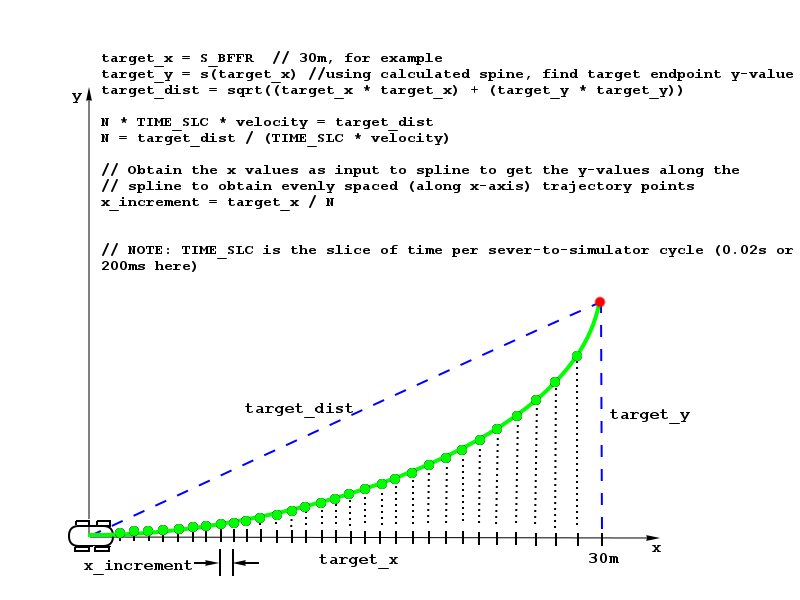

# Model Documentation
---

## Generating Trajectory
The model leverages the [Cubic Spline interpolation in C++](http://kluge.in-chemnitz.de/opensource/spline/) library to help create the trajectory for the self-driving car in the car simulator. To generate the trajectory spline, several anchor points are calculated and used as input to the spline class. As shown in **main.cpp**, *lines 504-618*, the bulk of the trajectory generation is taken up by the calculations for the anchor points of the target spline.

To start, and to ensure a smoother transition from cycle to cycle, the previous path end points, `previous_path_x` and `previous_path_y`, are used if available. Otherwise, the ego car's current position is used (*lines 515-545*). Then in Frenet coordinate system, using the target lane for `d` position and fixed increments added to the car's `s` state, three additional anchor points are created (*lines 547-560*). Note that these anchor points in Frenet coordinates are converted to cartesian X-Y map coordinates using the `getXY()` function. Continuing, the frame of reference of the anchor points (the previous path points plus the additional targeted projection points) are shifted to a zero-degree reference yaw angle to make the math work easier(*lines 547-570*). In effect, we transform the car to be moving to the right horizontally (the X-axis), while the Y-axis is perpendicular to the car's shifted direction of travel. The shifted anchor points are then supplied to the spline class to create the projected spline function (*lines 572-576*).

Next, the final trajectory of points is generated by first queueing up any previous path points that were left over from the previous messaging cycle with the car simulator. Following the previous path points, the returned spline function is used to output the remainder of the projected path points. To get evenly spaced trajectory points for a smoother curve, we first decide on the total number of points we want. In this case we want 50 points. We subtract the number of previous end points from 50 and use the remainder to create the addional increments to make up a total of 50 points for the trajectory. Now with the 50 x-values, we input these values into the spline function that we created earlier with the anchor points and get back the corresponding y-values. Recall that earlier the x-y points were shifted to a different frame of reference for easier calculations. We now rotate the x and y-values back to their normal frame of reference. Finally, together these x and y-value pairs make up the trajectory points that we supply to the simulator via the next messaging update cycle, allowing the car to smoothly transition on the projected trajectory (*lines 582-619*). See the following figure for the geometry details of the trajectory generation.

---

## Changing Lane
A lane change is initiated when the car comes too close to a car in front of it in the same lane. Once the ego car detects that it is within the specified gap from the car in front, the car reacts to the proximity by preparing for a lane change.

#### From Left or Right Lanes
Changing lanes from either the Left lane or the Right lane is straight forward in that there is really a single option for either case--the car in either of these lanes can ONLY go to the Center lane. So, once the planner verifies that it is safe to make the change, the car is instructed to switch to the Center lane.

#### From Center Lane
While in the center lane, the car has two options when the need for a lane change arises. The car needs to decide whether to go left or right since this particular track has three lanes in the same direction of travel. To make this choice, the car monitors segments of the track in the lanes to either side of itself. Using the sensor fusion data, the number of cars are counted that fall into these segments(I called them 'pockets') in the adjoining lanes. The pocket that has the lesser number of cars is chosen to be the target for lane change. If both sides have the same number of cars, then the side with the higher maximum velocity is chosen. Should the planner determine that it is safe for the car to make the move to the chosen lane, the car proceeds with the lane change. 